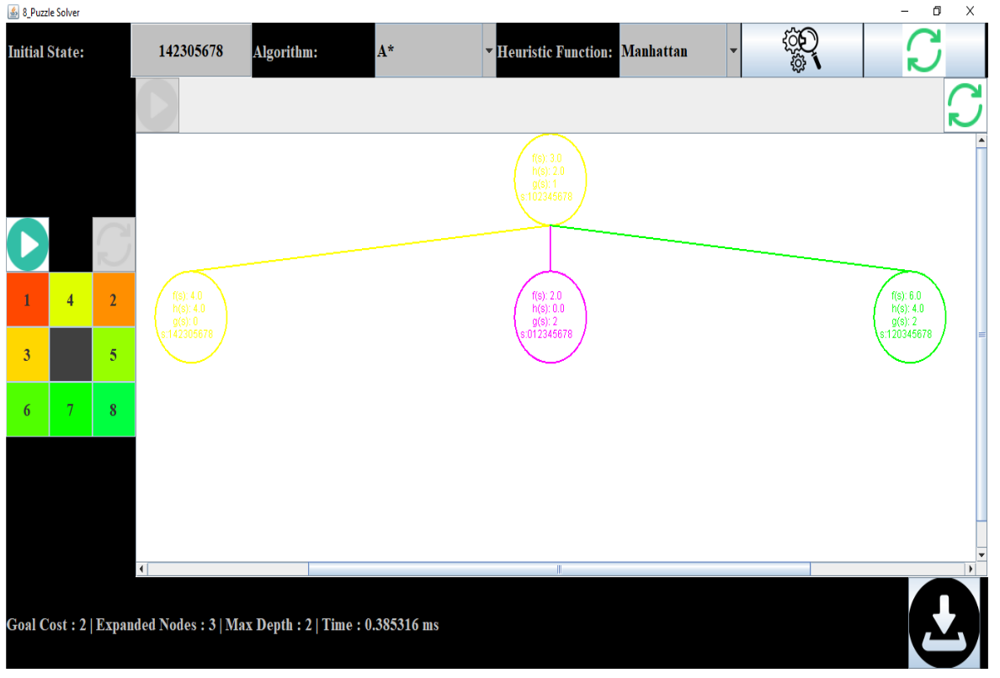
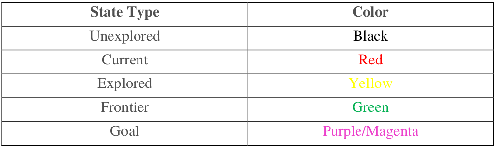

# Overview

1. Java Implementation using SWING for an 8 puzzle solver.
2. Supports DFS, BFS, and A*(using Manhattan and Euclidean distances) to solve the puzzle.
3. Detect when a puzzle is unsolvable.
4. Visualize how the search tree is formed for each solution.
5. Visualize how the puzzle is solved.
6. Show stats about the solution: # of expanded nodes, the time took in search, goal cost and max depth reached in search.
---

## GUI Sample

---
## Color code of search tree

